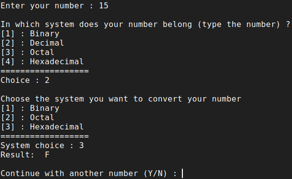

# Number System Converter
A program to convert a number from one system to another with the appropriate commands for each system.

<p align="center">
  
</p>

##  Number systems used in the program
* Decimal (base 10) : Any number by using any of the 10 digits (0 to 9).
* Binary (base 2)  : Any number by using any of the 2 digits (0 and 1).
* Octal (base 8)  : Any number by using any of the 8 digits (0 to 7).
* Hexadecimal (base 16) : Any number by using any of the 10 digits and 6 characters (0 to 9, A,B,C,D,E,F).

## Functions used in the program
### convert()
The basic function of the program which contains basic commands to transform a number from one system to another.

### remove(...)
A simple function used for 'removing' the extra printed characters ***"0b"**, ***"0o"** or ***"0x"** used for binary, octal and hexadecimal systems.

### invert(...)
A simple function used to invert 0 to 1 and 1 to 0 in string format.

## How it works
At first user is asked to give the initial number and at the same time to select the system in which this number belongs.
Then based on the above informations the number which user has entered is being converted to an integer by one of the following commands : 
```
int(num, 2)  # If num is the number and system is binary
int(num)     # if num is the number and system is decimal
int(num, 8)  # If num is the number and system is octal
int(num, 16) # If num is the number and system is hexadecimal
```
Then set variable **temp** equal to one of the above.
The user is asked to choose in which system he would like to convert the initial number except the initial system.
Finally the appropriate commands are used to convert the number.
```
temp      # Gives the number to decimal system
bin(temp) # Gives the number to binary system
oct(temp) # Gives the number to octal system
hex(temp) # Gives the number to hexadecimal system
```

## Additional Information
In case that user enters a negative number then the program uses the following procedure. 
Let's say for example that we want to convert -123 to hexadecimal.
```
1. Transform positive 123 to decimal : 
   a = bin(123) # 1111011
2. Add 0's to decimal a if it's digits are less than 8 : 
   a = '0'*(8-len(a)) + a # 01111011
3. Invert all digits using the invert() function and save it as a string b. Initialize b='' : 
   for let in a:
       b += invert(let)
       # 10000100
4. Add '1' to the above result and remove extra chars using remove() function : 
   c = remove(bin(int(b, 2) + int('1', 2)))
5. Convert to hexadecimal system : 
   result = hex(int(c, 2)) # 85
6. Add F's in front of the result to show that number is negative.
   Number of F's should be as many as needed to fill the length of 8 digits. : # FFFFFF85
```

## Author
* **Konstantinos Thanos**
